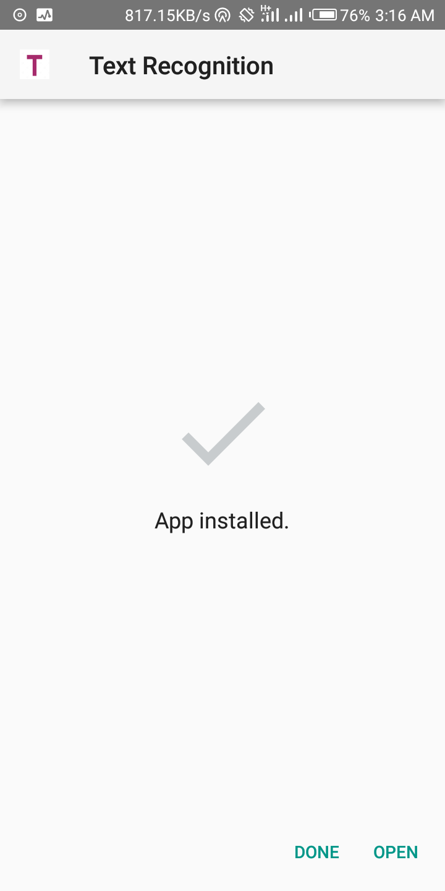
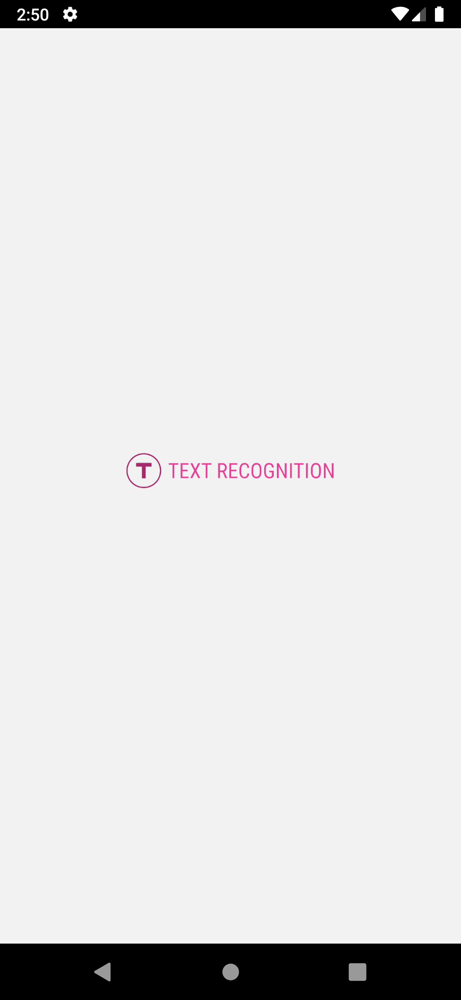
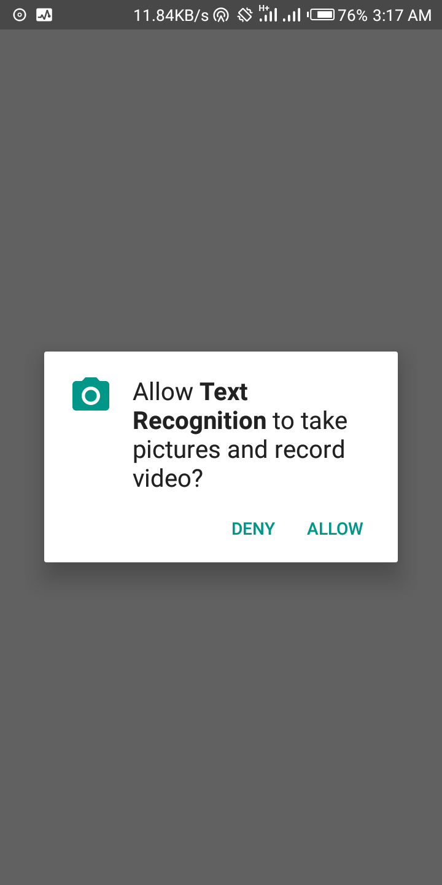
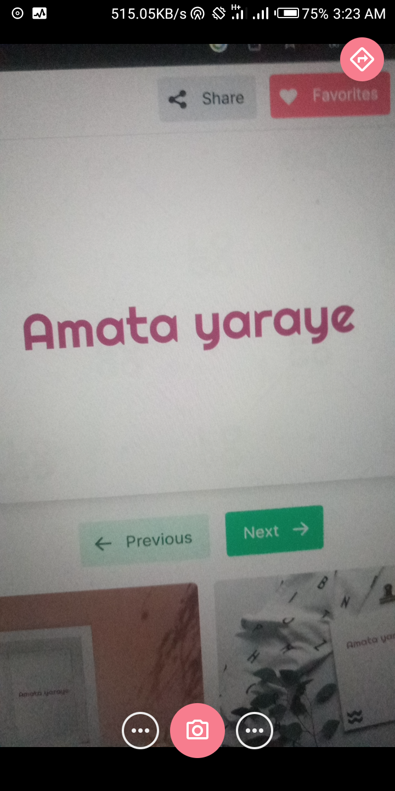
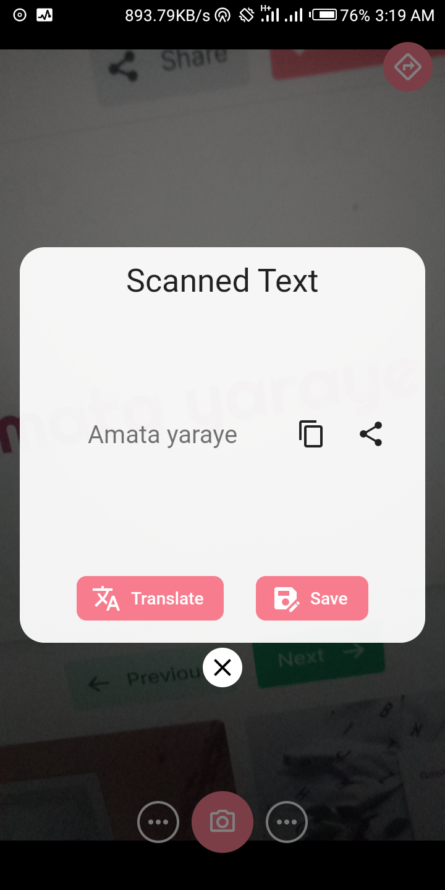
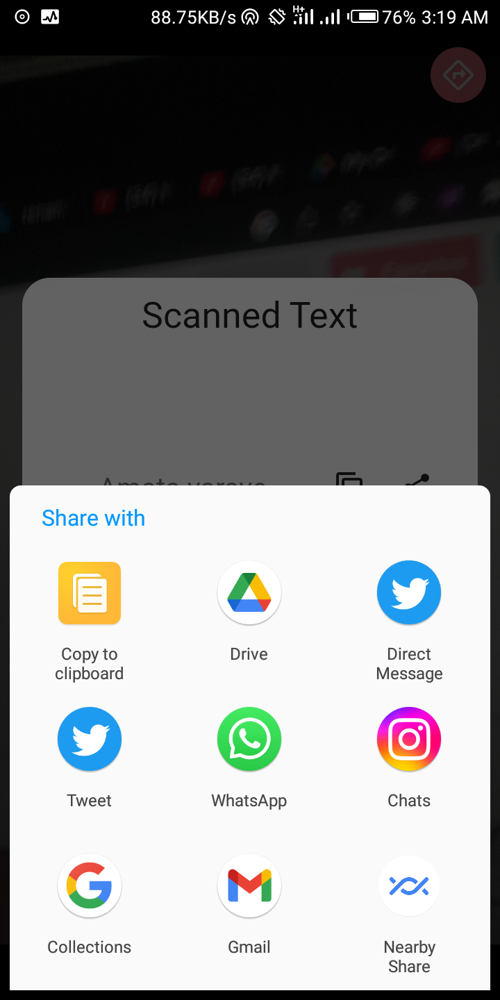
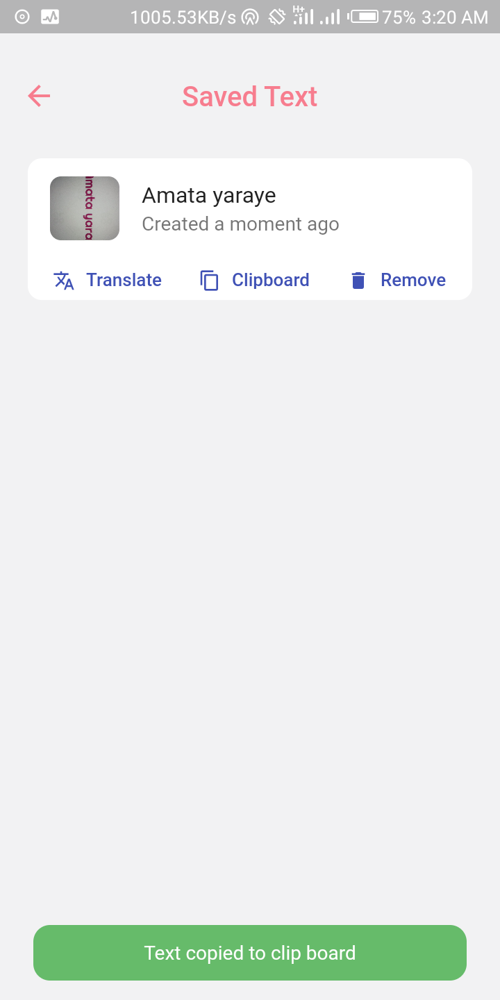

# Text Recognition App

Text recognition app in Flutter. Able to recognize text from camera/photo

## Features & Tools
- Android/iOS native camera API
- AI - Google ML Kit Text Recognition
- Hive - Offline database for saving scanned texts
- Scanning text from camera
- Taking photo from camera
- Redirecting to Google Translate page to translate the scanned text into any preferred language
- Copying scanned text to clipboard 
- Save and delete scanned text
- Sharing scanned text to native platforms
## Get APK
```bash
My Google Drive link,.. coming soon,...
```
## Screenshots
<p>







</p>

## Platforms
- Android ✅
- iOS ✅
### Author
- [Aimelive](https://github.com/aimelive)

